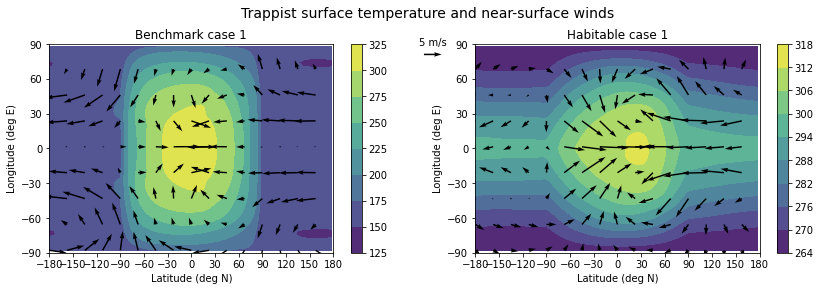
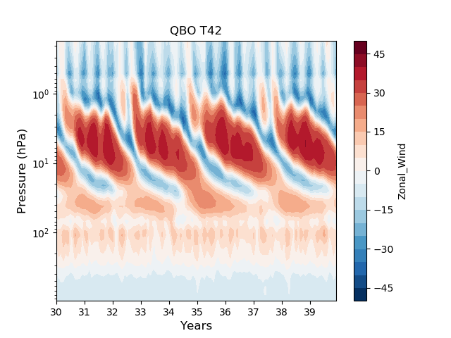

Overview
========

Welcome to Isca!
On this page and those following you will find the documentation to help you understand and run Isca. You can find a briefer and more general overview `here <https://execlim.github.io/IscaWebsite/>`_ and the code itself is on `github <https://github.com/ExeClim/Isca>`_.

About Isca
----------

Isca is a framework for the construction of models of the global circulation of the atmosphere of Earth and other planets at varying levels of realism and complexity.  The framework uses the dynamical core and the software infrastructure (FMS, for Flexible Modeling System) from the Geophysical Fluid Dynamics Laboratory in Princeton, USA, and some of the physical parameterizations are also taken from there.  Isca itself is not a single model, nor is it intended to provide a fully 'comprehensive' model capable of weather forecasts or climate projections for policy use. Rather, our intent is to take the idea of a model hierarchy seriously and thereby enable the user to make appropriate models for the problem at hand, or to make a connected and traceable sequence of models with feedbacks and processes included or denied as appropriate, ranging from the very simple to the near comprehensive.

.. figure:: index_fig_marspv.gif
   :scale: 40

   Isca simulation of the northern Martian winter polar vortex, showing the evolution of Lait-scaled potential vorticity on the 300K isentropic surface from late autumn (Ls 230) through to late winter (Ls 300). Figure produced by Emily Ball (University of Bristol), on a developmental branch.

Isca's user friendly Python front end allows users to quickly and easily configure their experiments. Test experiments are included to aid the first-time user in understanding the framework, but can also be used as a basis for more specialised experiments. Because of it flexibility and intuitive interface, Isca now has many users thus creating an Isca community that, with the addition of the documentation you can find here, are able to support fellow researchers with ideas and solutions to problems.  The code is open source and downloadable from `github <https://github.com/ExeClim/Isca>`_, and if you have questions please `raise an issue <https://github.com/ExeClim/Isca/issues>`_ there.

The various options for Isca are described in detail in the links in the left column (where appropriate references are also given), and here we just give an overview of what is available. Please note that, since Isca is constantly being developed and improved, not all of the options are as yet fully documented.  We hope that you, the user, may also wish to contribute to Isca's development and documentation.

Options and configurability
---------------------------

The main code is written in Fortran 90 to which we provide a Python front end. The front end enables many model configurations, parameter changes and output options to be set without going into the code itself, but if you wish to make more substantial changes then editing the Fortran may be necessary.

Dynamical cores and variants:
^^^^^^^^^^^^^^^^^^^^^^^^^^^^^

* Primitive equation, spectral model on the sphere. This may also be configured as a zonally-symmetric model
* Shallow water model on the sphere
* Column model, for example for radiative-convective equilibrium studies
* Barotropic vorticity equation on the sphere

Radiative forcing
^^^^^^^^^^^^^^^^^
* Thermal relaxation: Held-Suarez, variations for terrestrial exoplanets, and a 'top--down' scheme that provides a self-consistent determination of the tropopause
* Grey radiation, with or without water vapour feedback
* Simple, two IR band (with an IR window) scheme, with a simple solar scheme
* Comprehensive, multi-band schemes using either SOCRATES or RRTM

Convection and boundary-layer schemes
^^^^^^^^^^^^^^^^^^^^^^^^^^^^^^^^^^^^^
* A very flexible moist and dry convective adjustment scheme, suitable for both Earth and other planetary atmospheres
* The Betts-Miller scheme (a well-known and much used convective relaxation scheme)
* A mass flux scheme (relaxed Arakawa-Schubert)
* A simple boundary-layer scheme

Clouds
^^^^^^
* A simple cloud scheme based on relative humidity and inversion strength.

Surface properties
^^^^^^^^^^^^^^^^^^
* Specified sea-surface temperatures
* A slab ocean with a prognostic SST
* A swamp land surface with an evaporative resistance
* A simple bucket model
* A simple vegetation model
* Realistic Earth continental outlines, or user-configurable idealized continental configurations
* User configurable topography

Test cases
^^^^^^^^^^
Various out of the box test cases are available that should run with no additional configuration. These include:

* The Held-Suarez test case
* An aquaplanet with a slab ocean and grey radiation
* A MiMA-like test case using RRTM
* An axisymmetric model
* A gas giant planet (Jupiter-like)
* Cases with realistic, Earth-like continents

Planets
^^^^^^^
Earth is, naturally, the planet to which Isca has most often been applied. However, models of varying degrees of sophistication of Mars, Jupiter, Titan, TRAPPIST-1e, and a generic tidally-locked exoplanet have or are being constructed.

   Simulations for the `TRAPPIST-1 Habitable Atmosphere Intercomparison (THAI) <http://www.nexss.info/community/workshops/thai>`_ project. TRAPPIST-1e is a tidally-locked rocky exoplanet and is a promising candidate for habitable surface conditions. Figure produced by Dr Matthew Henry.

The Future
^^^^^^^^^^
Isca, and this documentation, is constantly under development. A simple cloud scheme has recently been incorporated into Isca, and models of other planetary bodies are continually being developed. The next major model addition will be a fully interactive ocean as an integrated component of Isca and therefore configurable with the Python interface and flexible in its nature and use.  We invite contributions from users to add to its capabilities and improve its documentation.

   The Quasi-Biennial Oscillation (QBO), a wave driven periodic reversal of the stratospheric tropical winds on Earth. This was produced in Isca using the convective gravity wave parameterisation modified by Prof. Chaim Garkfinel. Figure produced by Ross Castle.

How to cite Isca
----------------
| The primary reference for Isca, and the one that should be cited if you use it, is:
| Vallis, G.K., Colyer, G., Geen, R., Gerber, E., Jucker, M., Maher, P., Paterson, A., Pietschnig, M., Penn, J. and Thomson, S.I., 2018. Isca, v1. 0: A framework for the global modelling of the atmospheres of Earth and other planets at varying levels of complexity.  *Geosci. Model Dev.*, 11, 843–859.
|
| In addition, if you use particular aspects of Isca please consider referencing one of the following papers: 
|
| For use of the SOCRATES radiation scheme:
| Thomson, S.I. Vallis, G.K., 2019. The effects of gravity on the climate and circulation of a terrestrial planet. *Quarterly Journal of the Royal Meteorological Society*, 145, pp. 2627–2640.
|
| To emphasize the hierarchical aspects of Isca, or if using the Mars, Jupiter or shallow water models:
| Thomson, S.I. and Vallis, G.K., 2019. Hierarchical Modeling of Solar System Planets with Isca. *Atmosphere,* 10, p.803.
|
| For a general discussion of the value of a hierarchical approach:
| Maher, P., Gerber, E.P., Medeiros, B., Merlis, T.M., Sherwood, S., Sheshadri, A., Sobel, A.H., Vallis, G.K., Voigt, A. and Zurita‐Gotor, P., 2019. Model hierarchies for understanding atmospheric circulation. *Rev. Geophysics,* 57, pp.250-280.
|
| For a simple surface model:
| Pietschnig, M., Lambert, F.H., Saint‐Lu, M. and Vallis, G.K., 2019. The presence of Africa and limited soil moisture contribute to future drying of South America. *Geophysical Research Letters,* 46(21), pp.12445-12453.
|
| For examples of different land configurations:
| Geen, R., Lambert, F.H. and Vallis, G.K., 2018. Regime change behavior during Asian monsoon onset. *Journal of Climate,* 31(8), pp.3327-3348.
|
| For the MiMA configuration of Isca, with the RRTM radiation scheme:
| Jucker, M. and Gerber, E.P., 2017. Untangling the annual cycle of the tropical tropopause layer with an idealized moist model. *Journal of Climate,* 30(18), pp.7339-7358.
|
| For exoplanets:
| Penn, J. and Vallis, G.K., 2018. Atmospheric Circulation and Thermal Phase-curve Offset of Tidally and Nontidally Locked Terrestrial Exoplanets. *The Astrophysical Journal,* 868(2), p.147.

Contents
========
.. toctree::
   :maxdepth: 1
   :glob:

   install
   begginers_guide
   examples/index.rst
   isca_structure
   modules/index.rst
   python
   changelog
   contributing
   testing/index.rst
   bve_swe_equations
   references
   remote_access

See also
========

- Isca `home page <https://execlim.github.io/IscaWebsite>`_
- Isca v1.0 model description: [VallisEtAl2018]_

License
=======
Isca is released under the terms of the `GPL-3.0 license <https://github.com/ExeClim/Isca/blob/master/LICENSE>`_.

Indices and tables
==================

* :ref:`genindex`
* :ref:`search`
