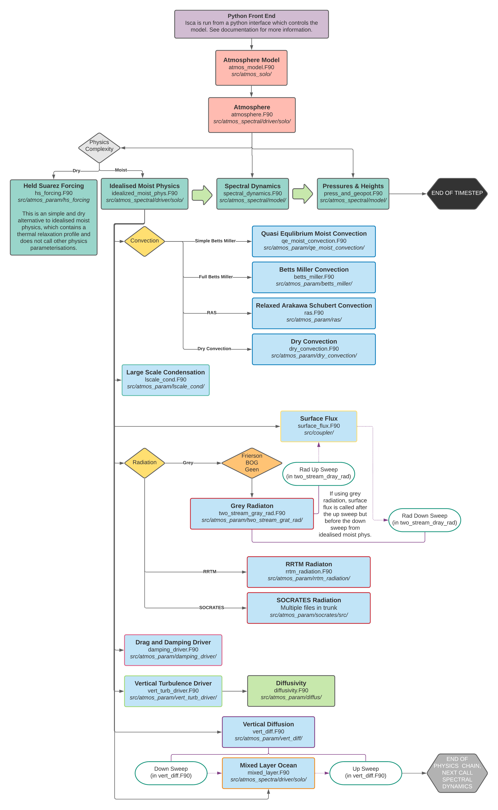
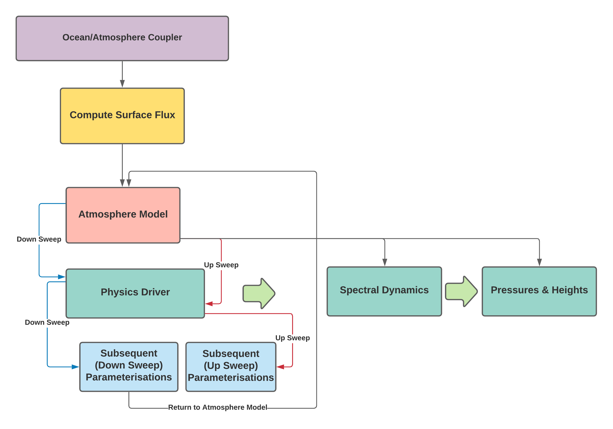

Isca's Code Structure
=====================

This page briefly shows the general order in which Isca's modules are called when running the code. It would be too complicated to show every single Fortran file, and the exact formulation would be different depending on the model configuration. The general structure for another spectral climate model is also shown.

Isca Structure
--------------
For ease and accessibility, Isca is controlled using a python interface which sets up the experiment runs. This then calls the atmosphere model (``atmos_model.F90``) which essentially just controls the model run, driving the dynamical core and calling the atmosphere module (``atmosphere.F90``) every timestep. This module in tern calls the physical parameterisations from the physics driver (usually ``idealized_moist_phys.F90``), the spectral dynamical core (``spectral_dynamics.F90``) and the vertical coordinate driver (``press_and_geopot.F90``). Most of the lower layer code, which is where the Isca's many different options are located, is called from the physics driver. This includes radiation schemes, convection schemes, damping and diffusion.

Note: If using grey radiation, the surface flux is calculated after the up sweep in the grey radiation code, but before the down sweep. In addition for any configuration, the mixed layer ocean code is called after the down sweep in the vertical diffusion code, but before the up sweep. 

   Flowchart showing the order of modules in the Isca code. No particular set up has been chosen here, for example, all possible calls to the radiation parameterisations are shown, when a model run would only call 1.

Comparison To Another Model
---------------------------

Our comparison here is based on the 2006 release of the GDFL spectral model. Because these models have an atmosphere ocean coupler, the model runs in a different, and slightly more complicated way. Note the multiple loops that the code must run through to do an up and down sweep. In Isca, because the mixed layer ocean is defined on that atmosphere grid, we can avoid these steps, meaning the model is easier to understand and use.

   Flowchart showing the order of modules in a 'normal' idealised GCM. 

Authors
-------
This documentation was written by Ross Castle and reviewed by Penelope Maher and Stephen Thomson.