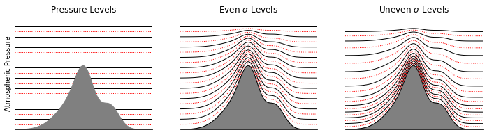

Vertical Coordinates
====================

Summary
-------

Climate models split the atmosphere into a number of different levels in order to calculate various quantities (e.g. temperature :math:`T`, zonal wind :math:`u`) throughout the depth of the model. There are a number of ways one may wish to divide the atmosphere; this is the purpose of the ``vert_coordinate`` module. Isca provides four different methods for prescribing model levels, which will be detailed later:

1. Manually prescribed levels 
2. Even Sigma levels 
3. Uneven Sigma levels
4. Hybrid Scheme

Glancing at any of the output files produced by Isca, one will notice that there are two different pressure levels listed. ``p_half`` represents the upper/lower boundaries of each model layer whilst ``p_full`` is the pressure height of the mid-point of each layer. Each of Isca's four level schemes produce an array of ``p_half`` values, from which the corresponding ``p_full`` are calculated.

Pressure or Sigma Levels??
^^^^^^^^^^^^^^^^^^^^^^^^^^

Whilst at first glance one might think the best way to divide up the atmosphere is using pressure levels (i.e. 1000-900hPa, 900-800hPa etc.), it is far more common in climate models to use what are known as sigma (:math:`\sigma`) levels, which are scaled pressure levels. Doing so is advantageous when topography is included in the model, as the different model levels form continuous functions; there are no discontinuities where the terrain intercepts the pressure levels.

The figure below compares a conventional pressure level based scheme against two different :math:`\sigma`-level schemes (even/uneven), with black lines and red dashes representing ``p_half`` and ``p_full`` values respectively. Note how the pressure levels intercept the mountain, whereas the two schemes using :math:`\sigma`-levels follow the curvature of the terrain. All three models have 10 levels.

.. note:: The model levels in any output files will follow the scheme selected in the namelist. If you wish to interpret these results in a pressure coordinate basis, it is necessary to interpolate back to standard pressure levels. If your model has no topography then :math:`\sigma`-levels are equivalent to pressure levels, so this is not required. *(Interpolation documentation will follow in future)*

Namelist options
---------------- 
There are a number of namelist controls that can be found relating to setting the model levels, however not all are used by each of the previously mentioned schemes. These namelist parameters can be found within the ``spectral_dynamics`` namelist. 

+---------------------+--------------------------------------------------+
| Name                | Description                                      |
+=====================+==================================================+
|``vert_coord_option``| Sets model level scheme                          |
+---------------------+--------------------------------------------------+
|``num_levels``       | Number of model levels                           |
+---------------------+--------------------------------------------------+
|``scale_heights``    | Sets height of model top                         |
+---------------------+--------------------------------------------------+
|``surf_res``         | Controls uniformity of model spacing             |
+---------------------+--------------------------------------------------+
|``exponent``         | Controls bias of model levels towards troposphere|
+---------------------+--------------------------------------------------+
|``p_press``          | Lower limit of pure pressure levels              |
+---------------------+--------------------------------------------------+
|``p_sigma``          | Upper limit of pure sigma levels                 |
+---------------------+--------------------------------------------------+

Prescribed Levels
^^^^^^^^^^^^^^^^^
Sometimes you may wish to manually set the pressure levels that are used in Isca: perhaps you want to directly compare a selection of similar models, or you wish to use the levels provided by another GCM. In order to use this mode we first set ``'vert_coord_option': 'input'``. In addition, we now need to supply a list of the levels we wish to use, which are added using the ``vert_coordinate`` namelist. The namelist ``bk`` contains the list of prescribed sigma levels that the model is to use - an example of which is shown below:

.. code-block:: python

  'vert_coordinate_nml': {
        'bk': [0.000000, 0.040000, 0.100000, 0.200000, 0.400000, 0.600000, 0.800000, 1.000000],
        'pk': [0.000000, 0.000000, 0.000000, 0.000000, 0.000000, 0.000000, 0.000000, 0.000000],
       }

Even Sigma
^^^^^^^^^^
This option will create an evenly spaced set of levels from sigma level 0 (top) to 1 (surface), scaled by the surface pressure set in ``spectral_dynamics``. To use this scheme, set ``'vert_coord_option': 'even_sigma'`` and also provide a value for ``num_levels``. Increasing the number of levels will decrease the thickness of each model layer.

Uneven Sigma
^^^^^^^^^^^^
The use of evenly-spaced model levels is often not the best option for atmospheric modelling, since the vertical structure of planetary atmospheres does not tend to fall into regions of even thickness. For example if one splits an Earth-like (surface pressure 1000hPa) model into 10 even regions, the entire stratosphere, which contains the Ozone Layer, is represented by only two levels. In addition, poor resolution near the model top can in certain configurations be unstable, since breaking gravity waves deposit significant amounts of energy into the upper layers; leading to violation of the `CFL criterion <https://en.wikipedia.org/wiki/Courant%E2%80%93Friedrichs%E2%80%93Lewy_condition>`_. 

An improvement one can make is to use an uneven sigma scheme, where the model levels are not equally spaced, selected with ``'vert_coord_option': 'uneven_sigma'``. In addition to a number of model levels, there are two additional arguments in the namelist that control the spacing of the levels. ``scale_heights`` sets the overall depth of the model, whilst ``surf_res`` changes the distribution of the levels and ``exponent`` controls the bias of these levels towards the surface. When ``surf_res=1`` levels are evenly spaced, and when ``surf_res=0`` model levels follow a function set by the exponent (with mixed behaviour at intermediate values). Setting ``exponent`` to higher values increases the amount of levels in the troposphere.

Hybrid Scheme
^^^^^^^^^^^^^
In models with particularly high top levels (for example models including the stratosphere and/or of other planets), running with a conventional sigma level scheme can be undesirable since the model can become unstable as a result of the surface topography being 'imprinted' on all model levels.  Calculations in the uppermost layers are more stable if the layers are flat. To overcome this we can specify a hybrid model level scheme, which combines :math:`\sigma`-levels in the lower atmosphere with :math:`p`-levels in the upper atmosphere (and a transition region in between). 

To use this scheme we set ``'vert_coord_option': 'hybrid'``, along with any namelist controls we previously used for the uneven sigma scheme, but we must also include two additional parameters to the namelist, ``p_press`` and ``p_sigma``. These two variables are values between 0 and 1, where 0 is the top :math:`\sigma`-level and 1 the bottom (surface) :math:`\sigma`-level, that represent the boundaries of the transition region between pure-pressure and pure-sigma levels (where ``p_press`` < ``p_sigma``).

Relevant modules and subroutines
--------------------------------

- ``spectral_dynamics_mod``

References
----------

Authors
-------
This documentation was written by Daniel Williams, peer reviewed by Stephen Thomson
