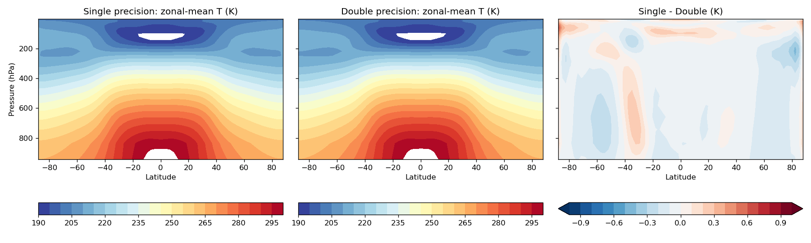
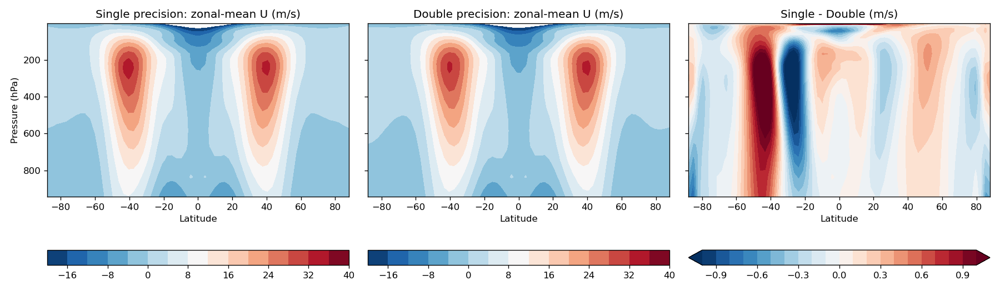

Single precision
=================

Summary
-------

By default, Isca is compiled using double-precision (8 byte) real numbers
throughout, regardless of what the underlying Fortran source declares -
this is enforced at compile time (``-r8`` for the Intel compiler,
``-fdefault-real-8``/``-fdefault-double-8`` for gfortran). Isca also
supports compiling in single precision (4 byte reals), which roughly
halves memory use and, depending on your hardware, may run faster.

This is a build-time choice, made once per compiled executable - you
cannot mix precisions within a single run.

How to use it
-------------

Call ``cb.use_single_precision()`` on your codebase object before
``cb.compile()``:
::
    cb = DryCodeBase.from_directory(GFDL_BASE)
    cb.use_single_precision()
    cb.compile()

This switches the compile macros from ``-DOVERLOAD_C8`` (double, the
default) to ``-DOVERLOAD_C4 -DOVERLOAD_R4`` (single), and selects a
separate, precision-specific environment file and mkmf template -
because the ``-r8``/``-fdefault-real-8`` flag that forces double
precision has to be *absent* from the single-precision build, which
can't be done with a compile macro alone. Concretely, if your
``GFDL_ENV`` is e.g. ``ubuntu_conda``, single-precision compilation
sources ``src/extra/env/ubuntu_conda_single`` (which points at
``mkmf.template.ubuntu_conda_single``) instead of the usual
``src/extra/env/ubuntu_conda``. Environment files ending ``_single``
are currently provided for ``ubuntu_conda`` and ``maths2`` - if you use
a different ``GFDL_ENV``, you'll need to add an equivalent pair
yourself, following either of those as a template.

**Please note** that not every module in Isca has been audited for
precision-correctness - the simple-cloud scheme (``cloud_simple``,
including ``lcl.F90``) has, since it's on by default in every model
configuration, but more specialised parameterisations may hardcode
``double precision`` somewhere and either fail to compile or silently
run at double precision regardless of this setting. If you hit this in
a module you use, the fix is generally to change the hardcoded
``double precision``/``real*8`` declaration to plain ``real``, as was
done for ``lcl.F90``.

Does it change the default (double-precision) build?
------------------------------------------------------

No. The changes needed to make ``real`` respond to the build's
precision (rather than being hardcoded) were validated with the
`trip tests <testing/trip_test.html>`_ against master, including
``socrates_aquaplanet_cloud`` - chosen specifically because it's the
one trip-test case that actually turns on the simple-cloud scheme at
runtime, not just at compile time. Both it and ``held_suarez`` pass
bit-identically, confirming this feature doesn't alter the default
double-precision build at all.

Performance and climate: a 10-year Held-Suarez comparison
-----------------------------------------------------------

To see whether single precision is actually faster, and whether it
changes the resulting climate, the standard Held-Suarez test case was
run for 10 years at T42L25 (``dt_atmos=600``, 32 MPI ranks), once with
``cb.use_single_precision()`` and once without, on identical hardware,
one after the other (not concurrently, so the two runs weren't
competing for the same cores/memory bandwidth, which would bias the
timing comparison).

Performance
^^^^^^^^^^^

.. list-table::
   :header-rows: 1

   * -
     - Double precision
     - Single precision
   * - Total integration time (10 years)
     - 8255s (2h 17m)
     - 6558s (1h 49m)
   * - Per simulated year
     - 13.8 min/year
     - 10.9 min/year

**Single precision was about 21% faster** (equivalently, double
precision took about 26% longer). This is a smaller speedup than the
theoretical 2x you might expect from halving the data volume - Isca's
communication pattern, I/O, and non-floating-point overheads don't
shrink with precision, so the achievable speedup depends on how much
of the run's cost is genuinely floating-point-bound. Your own mileage
will vary with resolution, core count, and hardware.

Climate
^^^^^^^

The first simulated year was discarded as spin-up; the remaining 9
years were used to build a time- and zonal-mean climatology for each
precision.

   Zonal-mean temperature, single precision (left), double precision
   (middle), and their difference (right). Differences are within
   about 1K everywhere, with no systematic pattern - consistent with
   sampling variability between two independent 9-year means of a
   chaotic system, not a precision-driven bias.

   Zonal-mean zonal wind. Both precisions reproduce the same
   double-jet structure (subtropical jet cores around 40°N/S, peak
   ~40 m/s at ~200 hPa) essentially indistinguishably. The difference
   panel's largest feature - up to ~1 m/s around 30-45°S - is a small
   shift in the exact position/strength of that one jet core between
   the two runs' 9-year means, not a hemispherically-symmetric
   feature you'd expect from a genuine precision bias.

Grid-point (not just zonal-mean) differences in the 9-year time-mean
climatology:

.. list-table::
   :header-rows: 1

   * - Field
     - Mean |diff|
     - Max |diff|
     - Double-precision field mean ± std
   * - Surface pressure (Pa)
     - 121
     - 375
     - 100089 ± 494
   * - Temperature (K)
     - 0.14
     - 0.84
     - 223.9 ± 28.1
   * - Zonal wind (m/s)
     - 0.42
     - 3.31
     - 3.65 ± 10.6
   * - Meridional wind (m/s)
     - 0.26
     - 2.73
     - 0.0006 ± 0.37

(``vor``/``div`` omitted from this table - in this zonally-symmetric,
topography-free configuration their long-term mean is essentially zero
for both precisions by construction, so a "relative difference" isn't
a meaningful number for them; the meridional wind row above has the
same property and should be read the same way - its own long-term
mean is near zero, so the absolute difference, while small in
physical terms, is comparable in size to the field itself.)

**Bottom line:** over a 10-year integration, single precision produced
a statistically indistinguishable climate from double precision, while
running about 21% faster.
